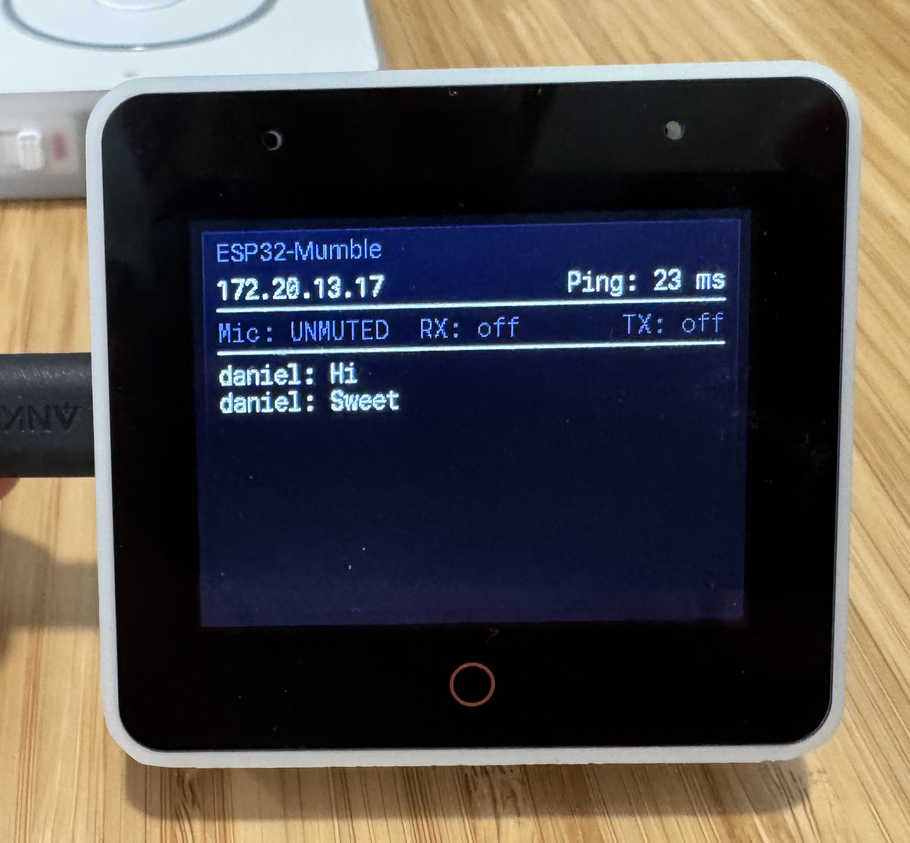

# ESP32-Mumble

An ESP32-S3 Mumble voice chat client for ESPHome, turning microcontroller boards into always-on intercoms and push-to-talk devices.



*The project running on an ESP32-S3-BOX connected to a local go-mumble-server instance.*

## What Is This?

ESP32-Mumble implements the [Mumble](https://www.mumble.info/) voice chat protocol on ESP32-S3 hardware. **Default crypto is Legacy** (OCB2-AES128, standard Mumble); **Lite** (cleartext UDP, minimal CPU) is optional for trusted LAN. Connects to [go-mumble-server](https://github.com/dchote/go-mumble-server) or Murmur.

The firmware runs as an [ESPHome](https://esphome.io/) external component, integrating with Home Assistant for configuration and control.

### Key Capabilities

- **Three operating modes**: Always-on intercom, push-to-talk, and **Communicator** (Star Trek-style half-duplex)
- **Crypto modes**: **Legacy** (default) — OCB2-AES128; **Lite** — cleartext UDP for trusted LAN; **Secure** — AES-256-GCM when server negotiates it (go-mumble-server)
- **Opus** audio encoding/decoding at 16 kHz
- **Microphone capture and transmit** (Opus encode, VAD, echo suppression)
- **Acoustic echo cancellation** for open-mic use
- **Home Assistant** entities for server config, mode, mute, volume, channel, and status
- **Multi-room** intercom via Mumble channels

---

### Communicator Mode

Communicator mode turns any supported board into a **Star Trek-style half-duplex intercom**. A single button press opens a communication session with an audible chime, transmits your voice, and automatically closes when you stop talking.

**How it works:**

1. **Press the button** — an open chime plays, then the microphone goes live
2. **Speak** — audio is transmitted via Mumble with VAD (voice activity detection); silence is not sent
3. **Stop speaking** — after 2 seconds of silence the session auto-closes with a close chime
4. **Press again during a session** — immediately cancels and plays the close chime

While a communicator session is active, incoming voice is suppressed so the bus stays on the microphone. The chime is embedded directly in the firmware as raw PCM and played through the component's own bus-aware speaker path — no media player needed.

Communicator mode is selectable from the **Mode** entity in Home Assistant (alongside Always On and Push to Talk) and persists across reboots. On boards with a physical button (Box, Box-3, Atom Echo, Voice PE), the same button handles all three modes automatically.

---

## Supported Hardware

| Board | Framework | Mic | Speaker | Highlights |
|---|---|---|---|---|
| ESP32-S3 Box | ESP-IDF | ES7210 mic array | ES8311 DAC | lwIP netconn UDP |
| ESP32-S3 Box 3 | ESP-IDF | ES7210 mic array | ES8311 DAC | Same as Box; pin differences |
| Home Assistant Voice PE | ESP-IDF | XMOS dual mic | AIC3204 DAC | Jog volume, mute slider, center PTT, LED ring |
| Onju Voice | Arduino | SPH0645 I2S | MAX98357A I2S | Nest Mini form factor, touch, LEDs |
| M5Stack Atom Echo | Arduino | PDM mic | External DAC | Compact |
| Generic ESP32-S3 | Arduino | Any I2S mic | Any I2S DAC/amp | User-defined pins |

All boards require an ESP32-S3 with PSRAM and Wi-Fi.

## Architecture

```
ESP32-S3                              go-mumble-server
┌────────────────────┐               ┌──────────────────┐
│ ESPHome Component  │──TCP/TLS────►│  Control (64738)  │
│                    │               │                   │
│ Mic/Opus encode    │               │  Voice  (64738)   │
│ Opus Dec ► I2S Spk │◄──UDP voice (rx/tx)────│
│                    │               └──────────────────┘
│ HA Entities ◄─────►│ Home Assistant
└────────────────────┘
```

See the full documentation:

- **[Product Overview](docs/product-overview.md)** -- Vision, use cases, features, and target hardware
- **[Technical Overview](docs/technical-overview.md)** -- Protocol details, audio pipeline, ESPHome integration, and hardware abstraction

## Prerequisites

- A Mumble server (e.g. [go-mumble-server](https://github.com/dchote/go-mumble-server) or Murmur) on your LAN
- [ESPHome](https://esphome.io/) 2026.7.0+ (pin via `pip install -r requirements.txt` → 2026.7.1)
- Python 3.12+
- [Home Assistant](https://www.home-assistant.io/) (optional, for configuration and control UI)
- One of the supported ESP32-S3 boards listed above

## Quick Start

```bash
# Clone, set Wi‑Fi in esphome/secrets.yaml; server defaults to empty and is auto-filled from HA when adopted
esphome compile esphome/esp32-s3-box.yaml   # Box: ESP-IDF; or generic-esp32s3.yaml for Arduino
esphome run esphome/esp32-s3-box.yaml --device /dev/ttyUSB0
```

For Box/Box-3 (ESP-IDF): first flash must be via USB, not OTA.

See [docs/build.md](docs/build.md) for full build and flash instructions.

## OTA Updates & Releases

Pre-built firmware is published from SemVer tags (`vX.Y.Z`) via GitHub Actions:

| Channel | URL |
|---------|-----|
| Web installer (USB / ESP Web Tools) | https://dchote.github.io/esp32-mumble/ |
| Per-board OTA manifests | `https://dchote.github.io/esp32-mumble/<board>/manifest.json` |
| GitHub Release assets | https://github.com/dchote/esp32-mumble/releases |

Board slugs: `esp32-s3-box`, `esp32-s3-box3`, `home-assistant-voice-pe`, `m5stack-atom-echo`, `generic-esp32s3`.

After a device is adopted in Home Assistant, the **Firmware Update** entity checks the board's GitHub Pages manifest (every 6 hours) and can install OTA updates. Manifests and `.ota.bin` files are hosted on Pages (not `releases/latest/download`) to avoid GitHub redirect URL length limits on the device HTTP client.

**One-time maintainer setup:** enable GitHub Pages for this repo with **Source = GitHub Actions** (Settings → Pages). See [docs/features/0015-ota-releases.md](docs/features/0015-ota-releases.md).

**Cut a release:**

```bash
git tag v1.0.0
git push origin v1.0.0
```

Configure Mumble server, port, username, password, channel, mode, and crypto from the Home Assistant UI after adding the device. **Server** defaults to empty and is auto-populated with the Home Assistant server IP when the device is adopted by HA (e.g. for the go-mumble-server addon); set it manually in YAML or HA to override. **Crypto** defaults to Legacy (OCB2-AES128). Values persist in NVS and are restored on boot. Username defaults to `esp32-<MAC>`; you can overwrite it. Changing server, username, password, channel, or crypto forces a reconnect. **Mode** selects between Always On, Push to Talk, and Communicator — switching modes takes effect immediately (mic is disabled when leaving always-on). Use **Speaker Volume** to adjust playback level. On Box/Box-3, **Speaker Power** controls the hardware amplifier. Diagnostics show connection status, ping, and voice activity. The **Reset Config** button restores all settings to defaults (server to empty, re-triggering HA auto-detection). See `esphome/generic-esp32s3.yaml` for the full pattern.

## Project Structure

```
esp32-mumble/
├── components/          # ESPHome external components
│   └── mumble/          # Mumble client component
├── lib/
│   └── micro-opus/      # Local Opus codec (v0.4.1; heap pseudostack, PSRAM, Xtensa)
├── scripts/
│   ├── build.sh
│   ├── flash.sh
│   ├── generate_communicator_chime.py
│   └── patch_mbedtls_requires.py
├── docs/
│   ├── build.md
│   ├── features/        # Including 0015-ota-releases.md
│   ├── product-overview.md
│   └── technical-overview.md
├── esphome/             # Example device configs + secrets.example.yaml
├── .github/workflows/   # build.yml (PR/main) + release.yml (tags → Pages/Releases)
├── requirements.txt     # Pins esphome==2026.7.1
├── SECURITY.md
├── README.md
└── LICENSE
```

Install the host toolchain with `pip install -r requirements.txt`. See [docs/build.md](docs/build.md) and [SECURITY.md](SECURITY.md).

## Contributing

This project is in early development. Contributions, ideas, and hardware testing are welcome. Please open an issue to discuss before submitting large changes. Run `pre-commit run --all-files` before opening a PR.

## License

[MIT](LICENSE)
